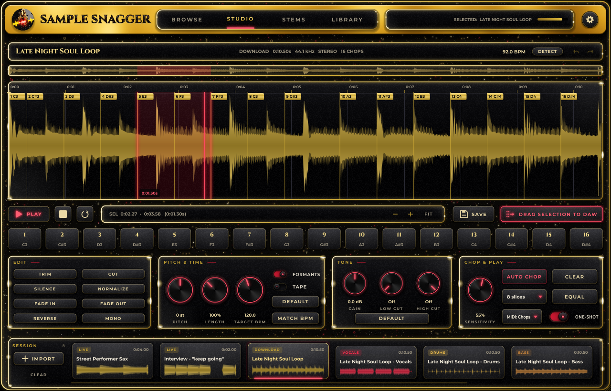
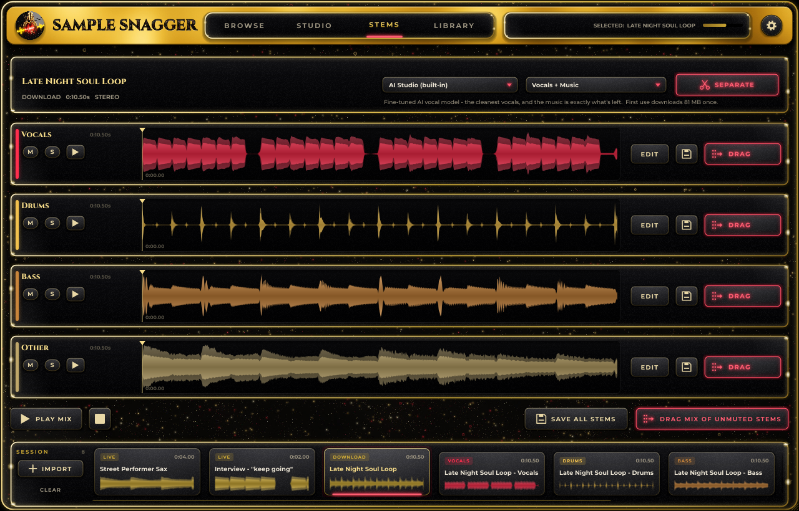

# Sample Snagger

**Capture · Chop · Separate.** A sampling plug-in and standalone app: black glass flecked with gold and red glitter,
a polished 24k gold title bar, gold-rimmed glass windows, brushed black knobs with neon red rings.
Browse YouTube (or any site) inside the plug-in, grab the audio the moment you hear something,
chop it, pitch it, split vocals from music, and drag the result straight onto a DAW track.

| Format | Where it works |
|---|---|
| **VST3** | Ableton Live, FL Studio, Cubase, Studio One, Reaper, Bitwig, Cakewalk... (Mac + Windows) |
| **AU** | Logic Pro, GarageBand, MainStage, Ableton on Mac |
| **Standalone app** | Mac + Windows (+ Linux) |
| **AAX** (optional) | Pro Tools (see [BUILD.md](BUILD.md#pro-tools-aax)) |
| **LV2** | Linux hosts |

---

## What it does

### 1. BROWSE - get audio from anywhere
- **Built-in web browser.** YouTube opens by default; one-click links for SoundCloud, TikTok, Instagram,
  Vimeo, Bandcamp, Internet Archive and Freesound. Type search words in the address bar to search YouTube.
- **LIVE REC** records whatever is playing on the page, like a tape deck. Press it, play the video, press again.
  On Windows 11 it records the built-in browser's own sound output, so it works on every site - including
  sound-effect libraries whose players a web page isn't allowed to listen to.
- **Hindsight: GRAB LAST 10s / 20s / 30s / 60s.** Sample Snagger quietly keeps the last minute of audio that played,
  so when you hear something great you can grab it *after* it happened.
- **HQ SNAG** downloads the page's audio in full quality (via yt-dlp - works with YouTube and 1,000+ sites).
  On sites yt-dlp doesn't know, it grabs the audio file the page is actually playing instead.
  Use **SET IN / SET OUT** while the video plays to snag just a section.
- **IMPORT** any audio or video file (mp3, wav, flac, aiff, ogg, m4a, mp4, mov, mkv, webm, avi...) - or just drop
  files anywhere on the window.
- **REC INPUT** records your audio interface (standalone) or whatever your DAW routes into the plug-in.

Every capture lands in the **Session tray** at the bottom. Tray clips are saved with your DAW project.

### 2. STUDIO - edit and chop
- Zoomable waveform with overview, selection, playhead and loop playback (Space = play/stop).
- **Edit:** Trim, Cut, Silence, Normalize, Fade in / out, Reverse, Mono - with 30 levels of undo / redo.
- **Pitch & Time:** high-quality pitch shifting and time-stretching (Signalsmith Stretch) with formant
  preservation, old-school *Tape* varispeed, BPM detection and **MATCH BPM** to your DAW's tempo.
- **Tone:** gain, 24 dB/oct low cut / high cut.
- The PITCH & TIME and TONE knobs apply as you turn them (you hear the change, even while it plays) and always
  work from the original sound; **DEFAULT** puts that panel back to the original. Each sample remembers its knobs.
- **Chop:** AUTO CHOP (transient detection with sensitivity), EQUAL slices, or alt-click to add markers by hand.
- **MIDI pads:** chop 1 plays on C3, chop 2 on C#3, and so on. Play them from your MIDI keyboard or the on-screen pads.
  One-shot or gated. **KEYS mode** plays the sample chromatically instead.
- **Drag to DAW:** drag the selection, the whole sample, or *any single pad* onto a track.
- **SAVE** writes a WAV into your sample library.

### 3. STEMS - separate vocals and music
- **Pick the parts you want** from the menu: any mix of *Vocals, Music (everything but vocals), Drums, Bass,
  Guitar, Piano, Other* - or a preset. Sample Snagger picks the right AI model for you.
- **AI Studio (built in, the default):** studio-quality AI separation (Demucs v4) running natively inside the
  plug-in on all your CPU cores - no Python, no GPU, works offline. Each model (about 50-80 MB) downloads once,
  the first time it's needed.
  - *Vocals + Music* uses the fine-tuned vocal model; the music is exactly the original minus the vocals.
  - *Drums / Bass / Other* use the 4-part model; *Guitar / Piano* the 6-part model.
  - *AI Studio Max:* four fine-tuned models, one per part - the cleanest result, about 4x slower.
- **Quick Split:** instant and rough - handy for a quick preview on stereo mixes.
- **AI via Python (optional):** the same models through PyTorch - only worth it if you have an NVIDIA graphics card.
- Play / stop each stem, or the mix. Click or drag in any stem to move the playhead - playback starts there,
  or jumps there if it's already playing.
- Solo / mute each stem, open any stem in STUDIO to chop it, save it, or drag it into your DAW.
  **DRAG MIX** exports just the stems you left un-muted (e.g. drums + bass only).

### 4. LIBRARY
Your saved samples (a normal folder, default `Documents/Sample Snagger/Samples`). Click to audition,
double-click to load into the tray, drag rows into your DAW.

---

## Install

Grab the installer for your system from the **Releases** page (built automatically by GitHub Actions - see below):

- **Mac:** `Sample-Snagger-x.y.z-macOS.pkg` - installs the AU, VST3 and the app.
  The builds are not notarised by Apple yet, so the first time: right-click the .pkg -> **Open**.
  If a DAW refuses to load the plug-in, run once in Terminal:
  `sudo xattr -dr com.apple.quarantine "/Library/Audio/Plug-Ins/Components/Sample Snagger.component" "/Library/Audio/Plug-Ins/VST3/Sample Snagger.vst3" "/Applications/Sample Snagger.app"`
- **Windows:** `Sample-Snagger-x.y.z-Windows-Setup.exe` - installs the VST3 into `C:\Program Files\Common Files\VST3`
  and the standalone app. (SmartScreen may warn about an unknown publisher -> *More info* -> *Run anyway*.)
- **Linux:** unpack the `.tar.gz` and run `./install.sh`.

Then rescan plug-ins in your DAW. Sample Snagger is an **instrument** plug-in - put it on an instrument / MIDI track.

### First run: helper tools (one click)
Open **Settings** (gear icon, top right):

| Tool | What it's for | Size |
|---|---|---|
| **FFmpeg** | video files + exotic audio formats, needed for HQ SNAG | ~30 MB |
| **yt-dlp** | HQ SNAG from YouTube and 1,000+ sites | ~35 MB |
| **Deno** | helps yt-dlp read YouTube reliably | ~40 MB |
| **AI Stem Models** | the built-in AI stem separation (also downloads by itself the first time you split) | 80-160 MB |
| **Python AI Engine** | optional - AI stems on an NVIDIA GPU (needs Python 3.9-3.13 from python.org) | ~2-3 GB |

Click **INSTALL ALL** for everything except the optional Python engine. They download from their official GitHub releases into
Sample Snagger's own folder - nothing else on your system is touched. LIVE REC, hindsight grabs,
Quick Split and everything in STUDIO work with no tools at all.

---

## Tips
- **YouTube asks you to sign in / age-restricted videos:** Settings -> *Use cookies from* -> pick the browser
  you're logged into. Or just use LIVE REC / hindsight.
- **HQ SNAG fails on YouTube after a while:** click **UPDATE** next to yt-dlp - sites change often and yt-dlp keeps up.
- **Record system audio from other apps (Spotify, a game...):** use the standalone app, choose a loopback
  input in Audio Settings (BlackHole on Mac, "Stereo Mix" or VB-Cable on Windows) and press REC INPUT.
- **Recording inside a DAW:** enable Sample Snagger's side-chain / audio input in your DAW and route a track into it,
  then REC INPUT. (Some DAWs, such as Ableton and FL Studio, don't feed audio into instrument plug-ins - use the
  browser capture, IMPORT or the standalone app there.)
- **Keyboard:** Space play/stop · Cmd/Ctrl+Z undo · Shift+Cmd/Ctrl+Z redo · Delete cuts the selection ·
  Cmd/Ctrl+1-4 switch tabs · Cmd/Ctrl+scroll zooms the waveform · double-click a chop selects it.

## Where things are stored
| | Mac | Windows |
|---|---|---|
| Sample library | `~/Documents/Sample Snagger/Samples` | `Documents\Sample Snagger\Samples` |
| Helper tools, AI models (`Models`), session cache, settings | `~/Library/Application Support/Sample Snagger` | `%APPDATA%\Sample Snagger` |

Session clips are cached as WAVs so projects reopen with their samples. You can delete old folders in
`Sessions` whenever you like.

## Sampling responsibly
Sample Snagger captures audio you can already hear or have on disk. Clear any samples you use in released music,
and follow the terms of the sites you capture from.

## Building from source
See [BUILD.md](BUILD.md). Short version: push this folder to a GitHub repository and the included workflow
builds installers for macOS, Windows and Linux; or build locally with CMake.

## Credits & licences
- [JUCE](https://juce.com) 8 - audio plug-in framework (AGPLv3 or JUCE commercial licence; if you sell this, check JUCE's licence tiers)
- [Signalsmith Stretch](https://github.com/Signalsmith-Audio/signalsmith-stretch) - pitch / time (MIT)
- [demucs.cpp](https://github.com/sevagh/demucs.cpp) (MIT) with [Eigen](https://eigen.tuxfamily.org) (MPL 2.0) - the built-in
  AI engine; models are Meta's [Demucs v4](https://github.com/facebookresearch/demucs) (MIT), converted by demucs.cpp
- [yt-dlp](https://github.com/yt-dlp/yt-dlp) (Unlicense), [FFmpeg](https://ffmpeg.org) (LGPL/GPL, downloaded separately),
  [Deno](https://deno.com) (MIT), Python Demucs (MIT) - installed on demand, not bundled
- Fonts: Cinzel and Montserrat (SIL Open Font License, see `Resources/Fonts`)
